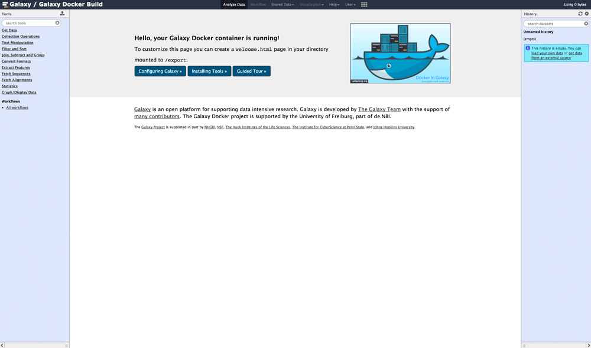

## Galaxy Installation Instructions 

* As soon as Galaxy has been installed within the BIBBOX, you can launch it from the Applications menu.

* Luckily, there are no additional steps needed to set up Galaxy, so it is already up and running!

    

## After the installation

Have a nice ride with the new Admins youngtimer.

