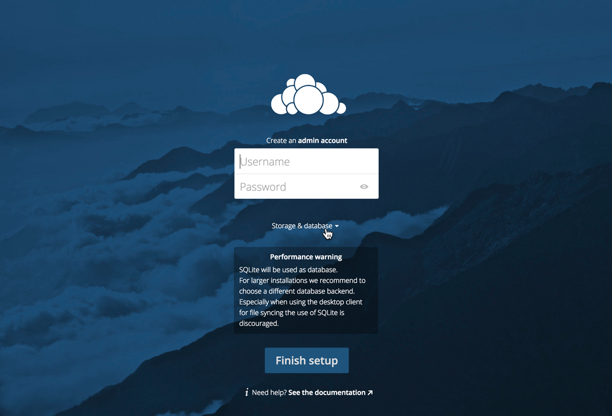
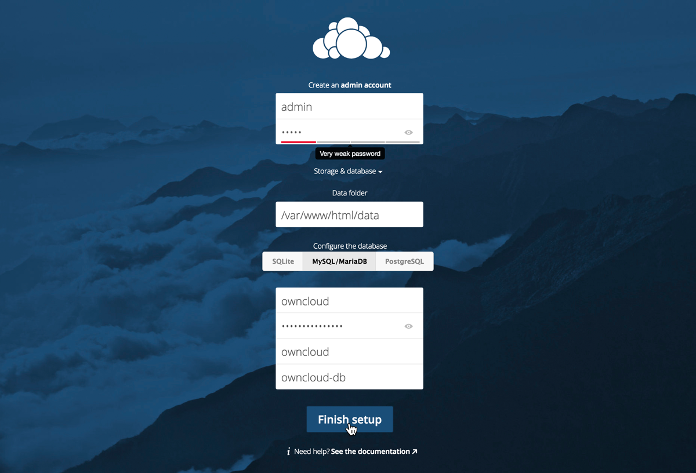
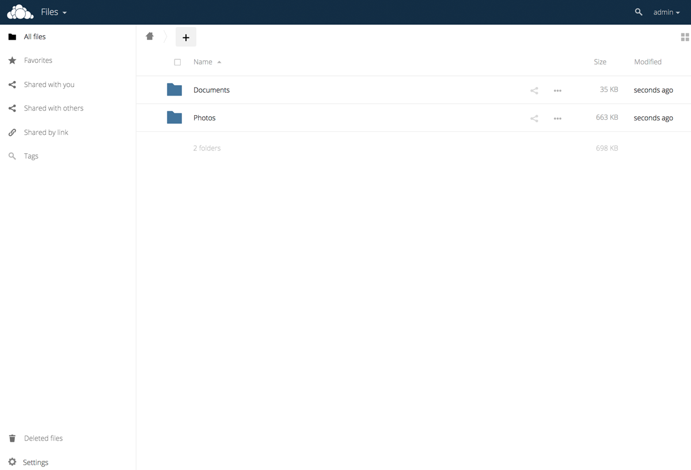

## Quick Notes

Database information is as follows:

```
Database user:      owncloud
Database password:  owncloud4bibbox
Database name:      owncloud
Database host:      owncloud-db
```


## Galaxy Installation Instructions 

* As soon as OwnCloud has been installed within the BIBBOX, you can launch it from the Applications menu.

* A new Tab will open in your browser and show you OwnCloud's setup page. In order to finish this setup process, we need to enter our database configuration. You can do this by clicking on **Storage & database**.



* This BIBBOX application already comes with an up and running MySQL database. So all you need to do is enter a OwnCloud **username** and **password** for your administrator account and enter the following information under the **MySQL/MariaDB** tab of the database configuration area:

        Database user:      owncloud
        Database password:  owncloud4bibbox
        Database name:      owncloud
        Database host:      owncloud-db
        
    After entering this information, go ahead and click the **Finish setup** button.



* That's it! Your new OwnCloud is now fully configured and ready to store and sync some data!




## After the installation

Have a nice ride with the new Admins youngtimer.


